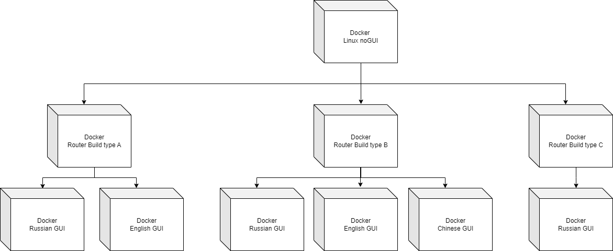

# Что такое докер?

Этот топик кратко расскажет о том, что такое докер и зачем им пользоваться. Мы не будем разбирать устройство докера до каждой строчки, так как это не необходимо для базового понимания и пользования. 

**Docker** - мощный инструмент, пришедший на замену виртуальным машинам, и занимается он **контейнерной виртуализацией**. Пользоваться им можно через **DockerHub** или через консоль windows/linux (windows требует wsl и предварительную установку поддержки), и докер позволяет удобно разворачивать сервисы и приложения. 

Зачем это нужно? 

1. **Всё что происходит внутри докера - остаётся внутри докера**. При обычном запуске сервисов и приложений на обычной или единой виртуальной машине, с ростом количества сервисов может увеличиться шанс конфликтов в работе. Особенно если они случайно используют один заготовленный путь хранения файлов, или при других похожих сценариях. Докер исключает подобные сценарии, так как все сервисы сидят по своим контейнерам и не трогают друг друга
2. **Докер создаёт идеальную среду**. Когда ты запускаешь сервис на своей машине, то велика вероятность, что на ней уже что-то стояло, или обновился пакет библиотеки, поменявший команду в коде, или любой другой сценарий, который случается в активно развивающихся системах. В докере можно указать необходимые зависимости и версии этих зависимостей, и мы получаем гарантию, что в докере будет только то, что мы прописали, и без нашего вмешательства оно никогда не поменяется. 
3. **Простота развёртывания и свёртывания**. Надоел сервис? Погасил. Нужно снова вернуть? Поднял одной кнопкой. Не надо вычищать папки и смотреть, куда сервис положил свою старую БД
4. **Экономия виртуальных ресурсов**. Докер жрёт меньше, чем виртуальная машина, сильно меньше
5. **Наличие сообщества**. В отличие от инструкций по развёртыванию, можно найти на докер хабе контейнер с нужным сервисом, скачать и развернуть одной кнопкой, не обязательно копировать код со StackOverflow или github-а

В общем, сплошные плюсы. Из минусов - надо потратить время на изучение команд и сборок докера, но в дальнейшем это сэкономит громадное количество личного времени и ресурсов

Примеры полезности: 
Есть стандартные примеры, где поднимается один сервис в одном докере, но я хочу поделиться своим. 
Собирался стандартный докер простого linux, используя который собирался докер билда роутера, и на их основе собирался докер с визуальным интерфейсом. Выглядело это примерно так: 

Это позволяло: 
1. Не плодить сущности, где вместо кучи одинакового кода написано только необходимое
2. Использовать принципы наследования, когда изменение в родителе отражалось на всех детях, без необходимости править конфиг каждого
3. Также это давало все все плюсы, которые были перечислены выше

На этой стадии нам уже понятно, что докер это упрощающий жизнь инструмент. Перейдём к [теории и практике](home/prepare-docker) 
